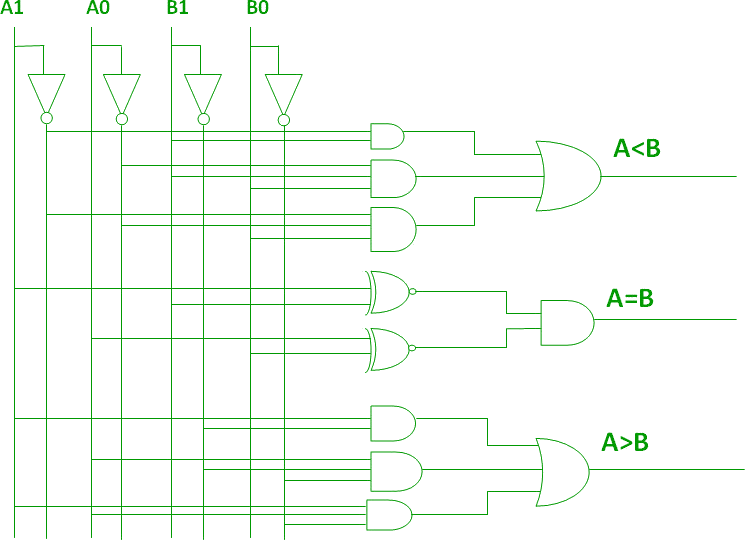
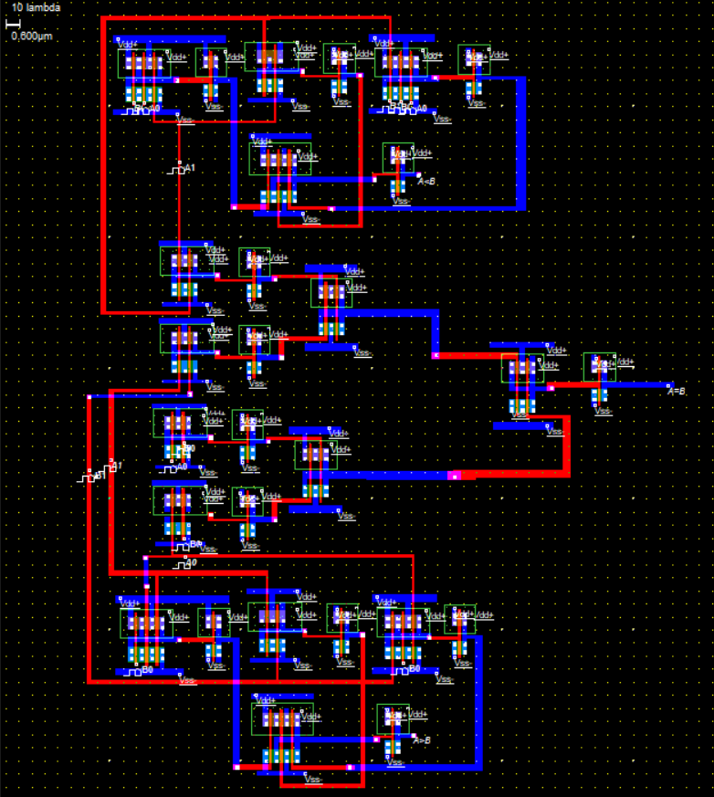
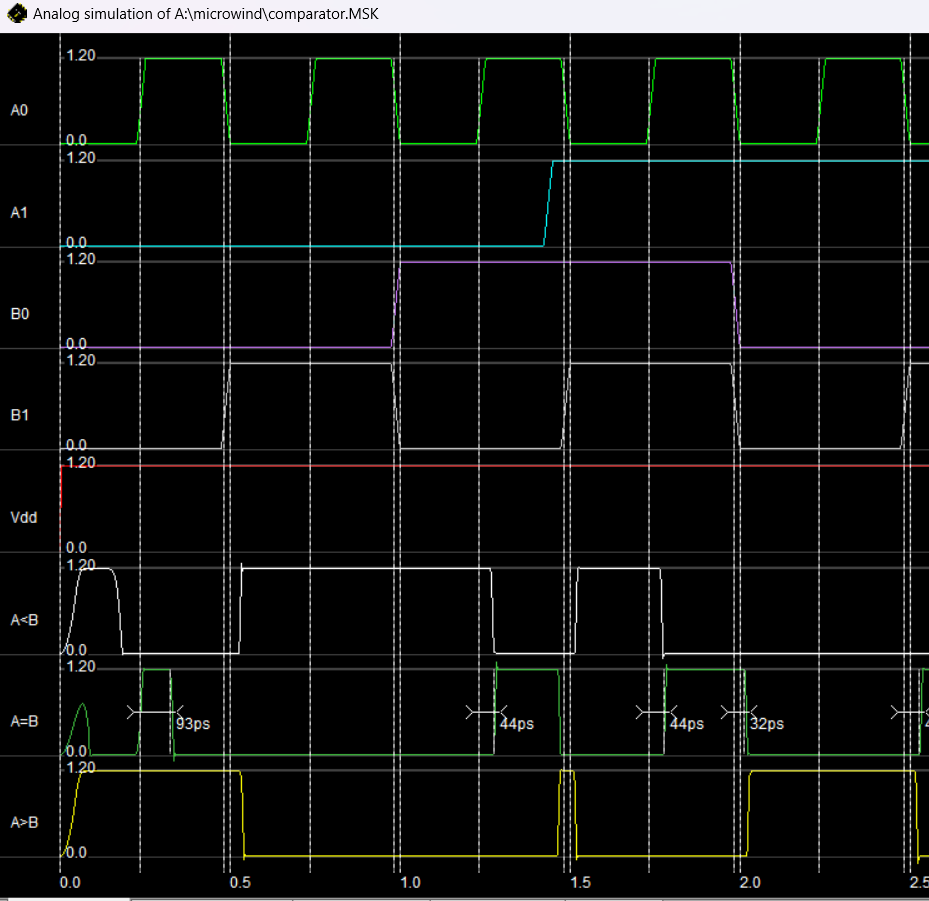

<div align="center">

# CMOS Design Project: 2-Bit Comparator
 <br>
## Indian Institute of Information Technology, Nagpur  
**ECL 312: CMOS Design**  
**A Project Report on: 2-bit Comparator Using CMOS**

**Submitted By:**  
[**Ayush Ambatkar (BT22ECI005)**](https://github.com/Ayush)

**Contributors:**  
[**Jjateen Gundesha (BT22ECI002)**](https://github.com/Jjateen) – SPICE Netlist Creation

**Under the Guidance of:**  
Prof. Paritosh Peshwe  

**Department of Electronics and Communication**

</div>

## Project Overview

The **2-bit digital comparator** project presents a CMOS-based circuit designed to compare two 2-bit binary inputs, `A` and `B`, and output three signals indicating their relationship: whether `A` is **less than**, **equal to**, or **greater than** `B`. The circuit was designed using **CMOS gates** such as AND, OR, XNOR, and inverters to achieve accurate and power-efficient performance. The netlist provides a foundational structure for simulating the circuit and guiding its layout.

## Objectives

1. **Design** a 2-bit CMOS comparator.
2. Generate three output signals indicating the comparison result (`A < B`, `A = B`, `A > B`).
3. Implement the circuit using **basic CMOS gates**.
4. Verify the circuit's operation in **WinSpice**.
5. Develop a layout suitable for fabrication using **Microwind**.

## Design Description

### Circuit Operation

The comparator circuit receives two 2-bit binary inputs, `A (A1A0)` and `B (B1B0)`, and produces the following outputs:
- **`A < B`**: Active when `B` is greater than `A`.
- **`A = B`**: Active when both inputs are equal.
- **`A > B`**: Active when `A` is greater than `B`.

### Logic Implementation

- **Equality (`A = B`)**: Achieved using **XNOR gates** for each bit pair and an **AND gate** to combine the results.
- **Less Than (`A < B`)**: Implemented with **AND gates** to evaluate conditions like `A1 < B1` or, if `A1 = B1`, `A0 < B0`.
- **Greater Than (`A > B`)**: Uses **AND gates** for scenarios where `A` has higher bits than `B`.

### Logic Gate Circuit Diagram
<div align="center">
    
</div>

## SPICE Netlist (Contributed by Jjateen Gundesha)

The SPICE netlist facilitates simulation in **WinSpice** for circuit functionality verification.

```spice
***2 Bit Comparator***

.model nmod nmos level=54 version=4.7
.model pmod pmos level=54 version=4.7

* Inverter Subcircuit
.subckt inverter in vdd out
M1 out in 0 0 nmod w=100u l=10u
M2 out in vdd vdd pmod w=200u l=10u
Cout out 0 1p
.ends

* AND Gate Subcircuit
.subckt and2 a b output vdd
M1 out a n1 n1 nmod w=100u l=10u
M2 n1 b 0 0 nmod w=100u l=10u
M3 out a vdd vdd pmod w=100u l=10u
M4 out b vdd vdd pmod w=100u l=10u
Xout out vdd output inverter
.ends

* Further details and the complete netlist can be found in the project documentation.
```

## Simulation Files and Waveforms

### WinSpice Simulation
The SPICE simulation was conducted in **WinSpice**, showing successful verification of the comparator's functionality.

<div align="center">
    
</div>

### Layout and Output Waveforms

The layout was designed using **Microwind**, adhering to CMOS design rules for a compact and efficient circuit.

#### Microwind Layout
<div align="center">
    
</div>

#### Output Waveforms from Microwind
<div align="center">
    
</div>

## Use Cases and Applications

1. **Threshold Detection**: Used in sensors for comparing data against set thresholds.
2. **Control Systems**: Essential for decision-making in microcontrollers.
3. **Sorting Operations**: Helps in digital circuits for selecting smaller numbers.
4. **Binary Counting**: Useful in circuits for determining specific binary values.
5. **Alarm Systems**: Triggers alerts when conditions are met.

## Challenges and Solutions

1. **Power Consumption**:
   - **Challenge**: High power usage due to multiple gates.
   - **Solution**: Implemented CMOS technology to reduce static power consumption and optimized transistor sizing.

2. **Area Optimization**:
   - **Challenge**: Large layout area due to numerous gates.
   - **Solution**: Shared logic gates and compact layout planning minimized the area.

3. **Signal Integrity and Noise**:
   - **Challenge**: Potential signal interference.
   - **Solution**: Adequate spacing and grounding for noise reduction.

## Conclusion

The 2-bit CMOS comparator was successfully designed, simulated, and verified. Key highlights include:
- **Accurate comparison** for two 2-bit inputs.
- **Power efficiency** and compact design using CMOS logic.
- **Challenges** such as power and area optimization were effectively addressed.

### Future Work

1. Extend the design to handle **8-bit inputs**.
2. Optimize for **lower power consumption**.
3. Implement **error correction** features.

## References

1. M. Beiser, "Low Power CMOS Circuits," IEEE Journal of Solid-State Circuits.
2. Cadence Virtuoso, "Custom IC and PCB Design."
3. Microwind, "CMOS Layout & Simulation Software."

---
